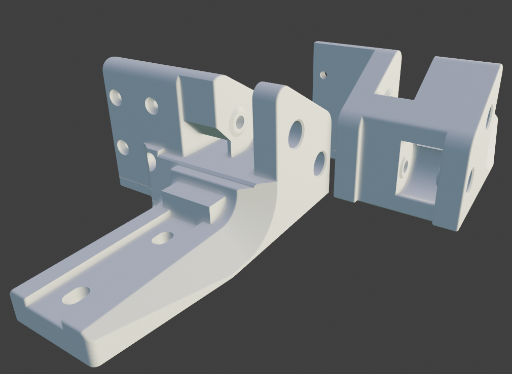

## Bat Gantry for 150mm MGN9

Bat gantry, but with all the holes unnecessary for 150mm rail removed.

Don't uses this unless you want to print spaghetti, flexes too much especially in z direction. 
